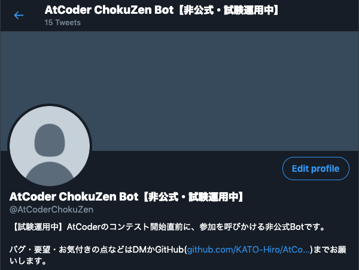
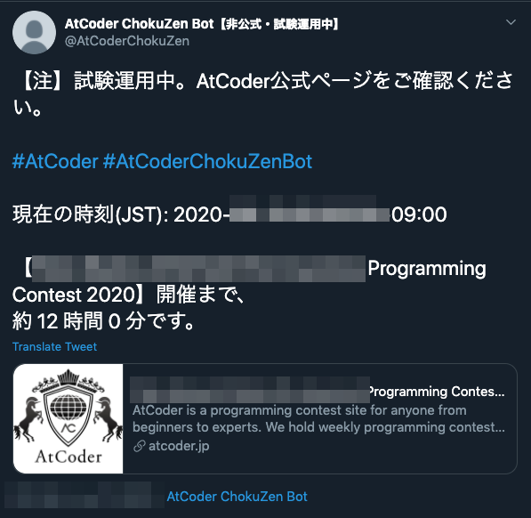

# AtCoderChokuZen

[](https://travis-ci.com/github/KATO-Hiro/AtCoderChokuZen)

## Description

A twitter bot that notifies you just before [AtCoder](https://atcoder.jp/) contest. The purpose is to reduce the number of times you forget to join contests. The bot was inspired by [tweets](https://twitter.com/chokudai/status/1267051182154936321).

***DEMO***





## Features

- Notify you to participate at regular intervals when the day of the contest comes.

## Usage

- Just click on the follow button on [twitter](https://twitter.com/AtCoderChokuZen).

## How to clone the repository

Paste the following commands at a Terminal prompt.

```terminal
$ mkdir hoge
$ cd hoge
$ git clone git@github.com:KATO-Hiro/AtCoderChokuZen.git
```

### Set up Twitter API in local env

1. Sign into your Twitter account, and apply for [a developer account](https://developer.twitter.com/).

2. After being approved, click "Create an app", and input App info. Next, click "Key and tokens" tab and "Create" button, you can get "Consumer API Keys" and "Access token info".

Note: The above keys give access to your Twitter account. Keep it confidential and never store them in this repository.

3. Create .env files or copy .env.sample as .env.

```terminal
$ touch .env
```

Open your editor, filling in your Twitter keys like below. XXXXX means your "Consumer API Keys" or "Access token info".

```
CONSUMER_KEY=XXXXX
CONSUMER_SECRET=XXXXX
ACCESS_TOKEN=XXXXX
ACCESS_SECRET=XXXXX
```

Note that .env file is in the project's .gitignore, so it won't be checked into this repository.

#### See

> https://qiita.com/kngsym2018/items/2524d21455aac111cdee

> https://qiita.com/hedgehoCrow/items/2fd56ebea463e7fc0f5b

### Debug in your local env

Paste the following commands at a Terminal prompt in your cloned directory.

```terminal
# Setup container
$ docker-compose build

# Run container
$ docker-compose up -d

# Stop container
$ docker-compose stop

# Run a command
$ docker-compose run --rm web hogehoge
```

## Requirement

- Docker Desktop 19+
- Python 3.8.x
- pip

### Hosting

- Heroku

### Optional

- [VS Code Remote Development](https://code.visualstudio.com/docs/remote/containers)

## Links

[AtCoder](https://atcoder.jp/)

[Original tweet](https://twitter.com/chokudai/status/1267051182154936321)

[Readme Driven Development; RDD](https://qiita.com/b4b4r07/items/c80d53db9a0fd59086ec)

## Author

[@KATO-Hiro](https://twitter.com/k_hiro1818)

## License

[MIT](http://KATO-Hiro.mit-license.org)
