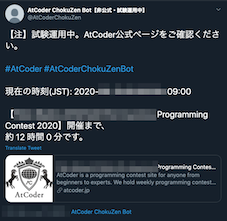
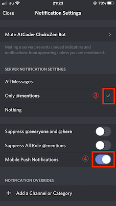
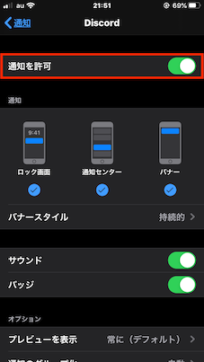

# AtCoderChokuZen

[](https://travis-ci.com/github/KATO-Hiro/AtCoderChokuZen)
[](https://codecov.io/gh/KATO-Hiro/AtCoderChokuZen)
[](https://github.com/KATO-Hiro/AtCoderChokuZen/issues)
[](https://github.com/KATO-Hiro/AtCoderChokuZen/pulls)
[](https://github.com/KATO-Hiro/AtCoderChokuZen/blob/master/LICENSE)

## Description (ツールの概要)

A twitter bot that notifies you just before [AtCoder](https://atcoder.jp/) contest (The messages can be forwarded push-notification via [Discord](https://discord.com/)). The purpose is to reduce the number of times you forget to join contests. The bot was inspired by [tweets](https://twitter.com/chokudai/status/1267051182154936321).

[AtCoder](https://atcoder.jp/)のコンテスト当日に、コンテスト情報をお知らせするTwitterボットです(お届けする内容は、[Discord](https://discord.com/)を経由して、お使いのスマートフォンにプッシュ通知することもできます)。このツールの目的は、コンテストに参加し忘れることによる機会損失を減らすことです。元ネタは、こちらの[ツイート](https://twitter.com/chokudai/status/1267051182154936321)。

***DEMO***

**A sample of push notifications on smart phone screen (スマートフォンにプッシュ通知が届いたときのイメージ画像)**


| Twitter | Discord |
|:-------------------------:|:-------------------------:|
|||

## Features (主な機能)

- Notify you to participate at regular intervals when the day of the contest comes.

  コンテスト当日になると、Twitterのタイムラインにコンテスト情報を放流します。

- Contest information will be delivered to your smartphone via push notifications using [Discord](https://discord.com/).

  [Discord](https://discord.com/)を利用することで、コンテスト情報をスマートフォンにプッシュ通知できます。

## Usage (使い方)

### View from Twitter timeline (Twitterのタイムラインから確認)

- Just click on the follow button on [Twitter](https://twitter.com/AtCoderChokuZen).

  Twitterのタイムラインをよく見る方、後から説明するプッシュ通知の設定がうまくいかない方は、こちらの[Twitter](https://twitter.com/AtCoderChokuZen)アカウントをフォローしてはいかがでしょうか?

### Push notifications to your smartphone (スマートフォンにプッシュ通知)

- Install Discord app from [Apple Store](https://apps.apple.com/us/app/discord/id985746746) or [Google Play](https://play.google.com/store/apps/details?id=com.discord&hl=en).

  Discordのアプリを[Apple Store](https://apps.apple.com/us/app/discord/id985746746)や[Google Play](https://play.google.com/store/apps/details?id=com.discord&hl=en)からダウンロードします。

- Access the [invite link](https://discord.gg/6feQqG5).

  [招待リンク](https://discord.gg/6feQqG5)にアクセスします。

- Input your email and password if needs.

  必要に応じて、Discordアカウント用のメールアドレスとパスワードを入力します。
  （お試しの方は、使い捨てのアドレスを用意するといいかもしれません）

- Settings for Notifications in Discord.

  Discordにおける通知の設定方法


  1. Tap "AtCoder ChokuZen Bot" […]

     "AtCoder ChokuZen Bot"の[…]をタップします。

  | English | 日本語 |
  |:-------------------------:|:-------------------------:|
  |||

  2. Tap "Notifications"

     "通知"をタップします。

  | English | 日本語 |
  |:-------------------------:|:-------------------------:|
  |||

  3. SERVER NOTIFICATION SETTINGS
    - Select "Only @mentions"
    - Turn on "Mobile Push  Notifications"

     Discordサーバの通知に関する設定をします。

    - 「@mentionsのみ」を選択

    - 「携帯電話にプッシュ通知を行う」を有効にする

  | English | 日本語 |
  |:-------------------------:|:-------------------------:|
  |||

- Settings for Notifications in your smartphone (iOS sample).

  スマートフォンに関する通知の設定 (iPhoneの一例)


  1. Tap "Settings"

     "設定"ボタンをタップします。

  | English | 日本語 |
  |:-------------------------:|:-------------------------:|
  |||

  2. Tap "Notifications"

     "通知"をタップします。

  | English | 日本語 |
  |:-------------------------:|:-------------------------:|
  |||

  3. Tap "Discord"

     "Discord"をタップします。

  | English | 日本語 |
  |:-------------------------:|:-------------------------:|
  |||

  4. Turn on "Allow Notifications"

     "通知を許可"をタップします（通知の表示方法や音なども、お好みで設定してください）。

  | English | 日本語 |
  |:-------------------------:|:-------------------------:|
  |||

## Frequently Asked Questions (よくある質問)

### Push notifications not working (プッシュ通知が届かない)

Recheck the following steps:

以下の項目を順に確認・実行すると、通知される可能性が高くなると思います。

- Recheck settings for "Notification" on your smartphone and Discord (See: Usage).

  スマートフォン本体およびDiscordの通知の設定を再度確認する（設定の例は、使い方を参照してください）

- Restart Discord app.

  Discord appを再起動する

- Restart your smartphone.

  スマートフォンを再起動する

- Reinstall Discord app.

  Discord appを再インストールする

### See (参考資料)

> https://support.discord.com/hc/en-us/articles/218892547--Mobile-Notifications-Settings-101

> https://aprico-media.com/posts/4798

> https://aprico-media.com/posts/4799

> https://kazu22002.hatenablog.com/entry/2015/09/24/070000

## How to clone the repository

Paste the following commands at a Terminal prompt.

```terminal
$ mkdir hoge
$ cd hoge
$ git clone git@github.com:KATO-Hiro/AtCoderChokuZen.git
```

### Set up Twitter API in local env

1. Sign into your Twitter account, and apply for [a developer account](https://developer.twitter.com/).

2. After being approved, click "Create an app", and input App info. Next, click "Key and tokens" tab and "Create" button, you can get "Consumer API Keys" and "Access token info".

Note: The above keys give access to your Twitter account. Keep it confidential and never store them in this repository.

3. Create .env files or copy .env.sample as .env.

```terminal
$ touch .env
```

Open your editor, filling in your Twitter keys like below. XXXXX means your "Consumer API Keys" or "Access token info".

```
CONSUMER_KEY=XXXXX
CONSUMER_SECRET=XXXXX
ACCESS_TOKEN=XXXXX
ACCESS_SECRET=XXXXX
```

Note that .env file is in the project's .gitignore, so it won't be checked into this repository.

#### See

> https://qiita.com/kngsym2018/items/2524d21455aac111cdee

> https://qiita.com/hedgehoCrow/items/2fd56ebea463e7fc0f5b

### Debug in your local env

Paste the following commands at a Terminal prompt in your cloned directory.

```terminal
# Setup container
$ docker-compose build

# Run container
$ docker-compose up -d

# Stop container
$ docker-compose stop

# Run a command
$ docker-compose run --rm web hogehoge
```

## Requirement

- Docker Desktop 19+
- Python 3.8.x
- pip

### Test framework and CI

- [Pytest](https://docs.pytest.org/en/stable/)
- [Travis CI](https://travis-ci.com/)

### Hosting

- Heroku

### Optional

- [VS Code Remote Development](https://code.visualstudio.com/docs/remote/containers)

## Links

[AtCoder](https://atcoder.jp/)

[Original tweet](https://twitter.com/chokudai/status/1267051182154936321)

Readme Driven Development; RDD<sup>[archive.org](http://web.archive.org/web/20220313000343/https://qiita.com/b4b4r07/items/c80d53db9a0fd59086ec)</sup>

## Author

[@KATO-Hiro](https://twitter.com/k_hiro1818)

## License

[MIT](http://KATO-Hiro.mit-license.org)
